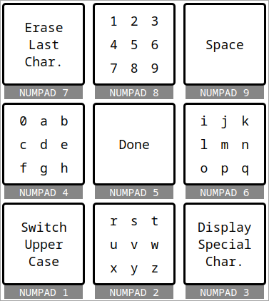

# keyboard9

keyboard9 is a virtual Keyboard implementation on a 3x3 grid intended to be able
to enter text much faster than the usual physicial-keyboard-imitating virtual
keyboards.

<p align="center">
  
</p>

A configurable demo is available here:
[https://peaberberian.github.io/keyboard9/examples/configurable_keyboard.html](https://peaberberian.github.io/keyboard9/examples/configurable_keyboard.html).

This concept is especially useful for devices without any keyboard yet with
multiple available keys such as game consoles (where you have a controller),
television set (where you have a remote control) and set-top boxes (where you
usually also have a remote control).

This project was first intended as a proof-of-concept for debugging purposes.
However, it is now completely functional and feature-complete so I decided to
open-source and publish it under the name `keyboard9`.

## How to use it

First, install the `keyboard9` package through your favorite package manager.

For example with `npm`:

```sh
npm install keyboard9
```

Or the same with yarn:

```sh
yarn add keyboard9
```

Then you can directly import it and use this as such:

```js
import createKeyboard from "keyboard9";

// Add keyboard9 to the end of the current page, with a default input element below it
const removeKeyboard = createKeyboard(document.body, {
    // Display keyboard9's default `<input>` element
    useDefaultInput: true,

    // Triggered once the text has been validated
    onDone: (text) => {
        console.log("The user entered:", text);
    },
});

// Then you may call `removeKeyboard` when you wish to remove the keyboard from
// your page.
```

This library has a very configurable API but I did not bother to write its
documentation yet!

You can look at examples in the `./examples` directory to obtain examples of
more advanced usages.
